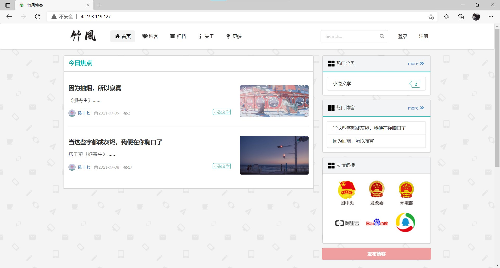

# 竹风小站——个人博客网站

个人博客网站，仅限交流与学习。



## 项目简介

**个人博客网站**，正如其名，是便于搭建和部署的小型个人博客项目。

该项目采用了IntelliJ IDEA作为开发工具，使用Spring Boot框架基于MVC框架进行开发，使用MySQL数据库，利用HTML，JavaScript，Ajax，Thymeleaf模板引擎和Semantic UI完成界面设计。

> 地址：https://www.chenaichenet.ltd

> 项目相关博客：

>Bilibili视频地址:

## 部署说明
### Windows

Windows下可以直接下载源码，进行编译运行即可，需要注意的是对应的软件安装成功且配置正确即可。

### Linux下

Linux下需要在需要对照SpringBoot配置文件中的文件上传路径，构建对应的目录（或者选择修改亦可），同时同样保证对应的软件安装成功且配置正确即可。

## 功能模块
### 普通用户功能介绍
| 功能 | 状态 | 简述 | 备注 |
| --- | :---: | --- | --- |
登录注册 | ✔️| 用户可以通过邮箱或用户名登录，统一使用邮箱注册 | 邮箱配置未加密 |
查看博客 | ✔️| 用户登录后查看博客详情 | 使用了权限隔离，未登录用户无法访问 |
分类博客 | ✔️| 用户可以点击分类来展示对应分类的博客 |  |
搜索博客、用户| ✔️| 搜索功能，通过关键字检索 | 无法细分搜索规则 |
点赞博客 | ❌️|  |  |
评论博客 | ✔️| 用户在博客详情页下的评论区域进行评论，实现了评论脱敏处理。 | 词库不完全，后期需要实现词库导入功能
评论管理 | ✔️| 用户可以管理自己所发的评论 |  |
收藏博客 | ❌️|  |  |
关注用户 | ❌️|  |  |
粉丝管理 | ❌️|  |  |
用户私信 | ❌️|  |  |
问题反馈 | ❌️|  |  |

### 管理员用户功能介绍
| 功能 | 状态 | 简述 | 备注 |
| --- | :---: | --- | --- |
博客管理 | ✔️| 管理员有权管理自己所发布的博客，进行修改或删除 | 权限隔离暂时存在问题
评论管理 | ✔️| 管理员可以管理对应博客下的评论 |  |
粉丝画像 | ❌️|  |  |
数据分析 | ❌️|  |  |
安全中心 | ❌️|  |  |
网站统计 | ❌️|  |  |
黑名单 | ❌️|  |  |

### 系统管理员功能介绍
| 功能 | 状态 | 简述 | 备注 |
| --- | :---: | --- | --- |
评论管理 | ✔️| 系统管理员有权管理所有博客下的评论 |  |
博客管理 | ✔️| 系统管理员有权管理所有已经发布的博客，进行修改或删除 |  |
博客审核 | ❌️|  |  |
博客统计 | ✔️| 统计已发布博客的数量 | 无法手动修改划分范围 |
博客搜索 | ✔️| 可以通过分类+关键字快速查找对应的博客 |  |
用户管理 | ✔️| 系统管理员有权管理所有已注册用户 | 管理功能单一 |
用户审核 | ❌️|  |  |
权限管理 | ✔️| 系统管理员有权管理所有用户的权限 | 权限单一 |
分类管理 | ✔️| 系统管理员有权管理所有已存在的分类，并能添加新分类 |  |
推荐管理 | ❌️|  |  |
系统黑名单 | ✔️| 系统实现了非法访问IP拦截，设置限制IP，可以禁止IP一段时间 | 封禁时间在配置文件中，缺点是无法手动添加IP |

## 技术框架及环境
#### 开发工具及测试环境
- 操作系统：Windows11、Linux 7.6
- 开发工具：IntelliJ IDEA 2021.1、Oracle JDK 11
- 数据库：MySQL 8.0.21、Redis 3.2.100
#### 后端框架
- Spring Boot 2.4.2
- Spring Data JPA
- Spring Security
- Hibernate
#### 前端框架模板及脚本
- Thymeleaf
- [Semantic UI中文官网](http://www.semantic-ui.cn/) 
- [编辑器 Markdown](https://pandao.github.io/editor.md/)
- [目录生成 Tocbot](https://tscanlin.github.io/tocbot/)
- [内容排版 typo.css](https://github.com/sofish/typo.css)
- [滚动侦测 waypoints](http://imakewebthings.com/waypoints/)
- [平滑滚动 jquery.scrollTo](https://github.com/flesler/jquery.scrollTo)
- [二维码生成 qrcode.js](https://davidshimjs.github.io/qrcodejs/)


## 目录说明
```text
docker/dockerfile         Docker文件

logs                      日志文件

src/main/java/com/chen/blog
- aspect                  日志配置
- config                  配置类
- controller              控制层
- dao                     数据访问层
- domain                  实体类
- filter                  过滤
- handler                 异常处理
- interceptor             拦截
- listener                监听
- service                 业务层
- utils                   工具类
BlogApplication           启动类

src/main/resources
- static                  静态资源
- templates               页面模板
application.yml           配置文件
*.pfx                     SSL证书
```

## 免责声明
该项目中的内容仅供技术研究与学习，不作为任何结论性依据，不提供任何商业化应用授权。